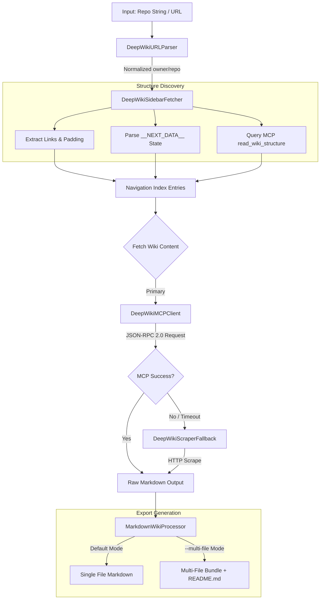
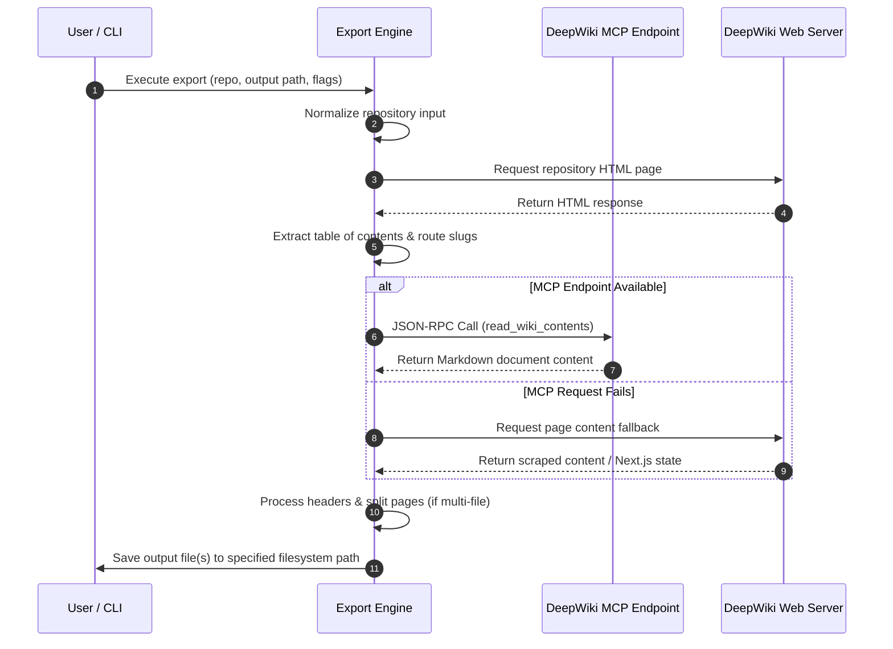

# DeepWiki Documentation Exporter

The DeepWiki Documentation Exporter is a Python-based utility designed to automate the extraction and local export of documentation from DeepWiki repositories. 

The application connects directly to Cognition's DeepWiki Model Context Protocol (MCP) server over JSON-RPC 2.0, fetches repository structures, and builds well-formatted Markdown documentation bundles locally. In cases where the protocol interface is unavailable, the exporter automatically uses a secondary client-side web parsing engine.

---

## Key Features

- **Zero Third-Party Dependencies**: Built entirely using the Python Standard Library (`urllib`, `re`, `json`, `pathlib`, `argparse`).
- **MCP JSON-RPC Protocol Support**: Communicates natively with Model Context Protocol endpoints using standard `tools/call` methods (`read_wiki_structure`, `read_wiki_contents`).
- **Sidebar Hierarchy Extraction**: Parses inline CSS styles (such as `padding-left` indentations) and Next.js page state blocks (`__NEXT_DATA__`) to preserve nested table of contents structures.
- **Flexible Export Modes**:
  - **Single-File Mode**: Compiles all repository content into a single, consolidated Markdown document.
  - **Multi-File Mode (`--multi-file`)**: Generates discrete Markdown files for each documentation page based on route slugs, alongside a root `README.md` index file.
- **Fault-Tolerant Architecture**: Implements automatic retries with exponential backoff for network interfaces and falls back to HTTP web scraping if the MCP endpoint is unreachable.
- **Flexible Input Parsing**: Accepts both shorthand repository identifiers (`owner/repo`) and complete standard web URLs (`https://deepwiki.com/owner/repo`).

---

## Architecture Overview

The application follows a structured workflow to parse input parameters, extract structure metadata, retrieve page content, and format output files.

### Workflow Diagram



### Execution Sequence



---

## Installation & Prerequisites

### System Requirements

- **Python Version**: Python 3.8 or higher.
- **Dependencies**: None. Only standard library modules are utilized.

### Setup

1. Save the code as `deepwiki_exporter.py`.
2. Ensure executable permissions are granted:

```bash
chmod +x deepwiki_exporter.py
```

---

## Usage Guide

### 1. Single-File Compilation

Consolidate an entire documentation repository into a single Markdown file:

```bash
python3 deepwiki_exporter.py d3bvstack/98-webserv -o ./output/webserv_docs.md
```

You can also provide a direct URL:

```bash
python3 deepwiki_exporter.py https://deepwiki.com/d3bvstack/98-webserv -o ./output/
```

### 2. Multi-File Documentation Bundle

Export pages as separate Markdown files mapped to their route slugs, along with a top-level `README.md` file:

```bash
python3 deepwiki_exporter.py d3bvstack/98-webserv -o ./output/webserv-docs/ --multi-file
```

### 3. Custom MCP Endpoint Specification

Specify an alternative or proxied MCP service endpoint:

```bash
python3 deepwiki_exporter.py d3bvstack/98-webserv \
  --multi-file \
  --mcp-endpoint "https://mcp.custom-domain.com/mcp"
```

---

## Command-Line Arguments Reference

| Argument | Short Flag | Type | Default | Description |
| :--- | :--- | :--- | :--- | :--- |
| `repo` | *(None)* | String | *(Required)* | Target repository identifier (`owner/repo`) or complete URL. |
| `--output` | `-o` | String | `.` | Target output file path or directory destination. |
| `--multi-file` | *(None)* | Flag | `False` | Splits documentation into individual files corresponding to navigation slugs. |
| `--mcp-endpoint` | *(None)* | String | `https://mcp.deepwiki.com/mcp` | Base URL for the DeepWiki MCP JSON-RPC service. |

---

## Output Structure

When using the `--multi-file` configuration, the tool generates a directory layout that preserves the navigation context of the source wiki.

```text
output_directory/
├── README.md               # Generated table of contents with nested links
├── 1-overview.md
├── 1.1-getting-started.md 
├── 1.2-configuration.md
...
```

### Generated Index Example (`README.md`)

Sub-sections reflect the structural depth parsed from the sidebar HTML components:

```markdown
<!--
  Generated by DeepWiki Exporter
  Repository: d3bvstack/98-webserv
  Source: https://deepwiki.com/d3bvstack/98-webserv
-->

# d3bvstack/98-webserv Documentation

## Table of Contents

- [Overview](1-overview.md)
  - [Getting Started](1.1-getting-started.md)
  - [Configuration](1.2-configuration.md)
- [Architecture Overview](2-architecture-overview.md)
  - [Event Loop and epoll Integration](2.1-event-loop-and-epoll-integration.md)
  - [Server Lifecycle and Connection Management](2.2-server-lifecycle-and-connection-management.md)
...
```

---

## Error Handling and Technical Specifications

- **Retry Logic**: Network calls initiated via `DeepWikiMCPClient` attempt up to 3 execution cycles using exponential backoff scaling (`1.5^attempt` seconds).
- **Format Normalization**: Route strings and section titles undergo regular expression normalization to ensure safe filesystem naming across operating systems.
- **Server State Extraction**: Next.js JSON payloads (`__NEXT_DATA__`) are automatically inspected to extract structured page props when direct HTML nodes are missing or dynamically hydrated.
